# ShopConn

ShopConn is flutter and firebase based mobile app

### Features!
  - shopping platform for buyer as well as seller
  - Simple and Consistance UI
  - Realtime Chat
  - Faster search results

### Screenshots
<p float="left">
  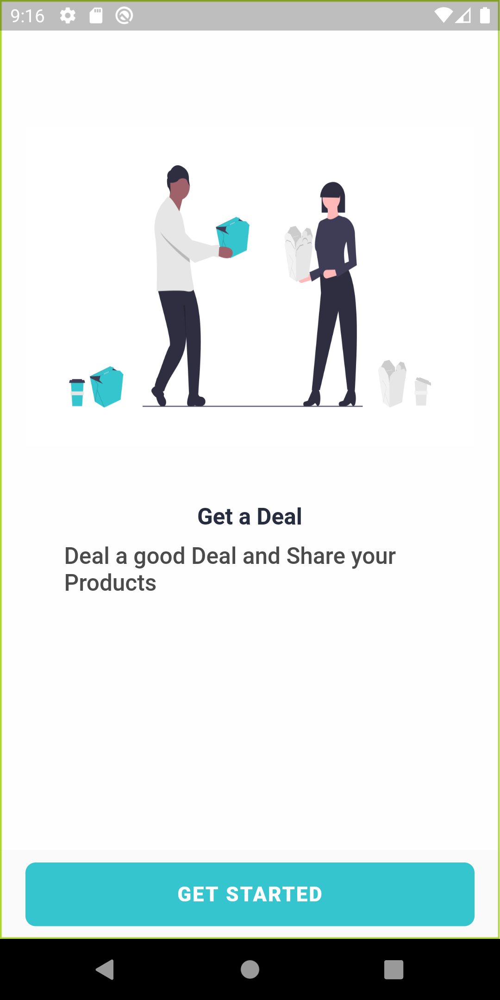
  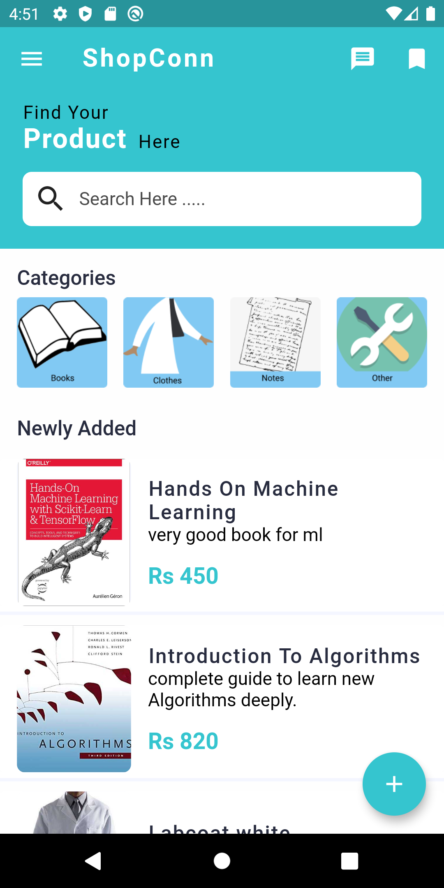
  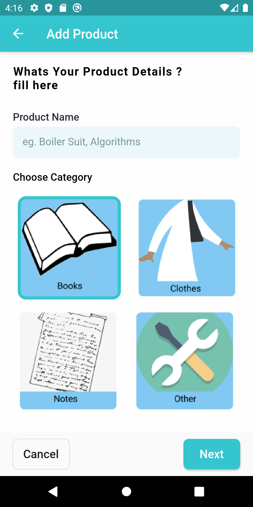
  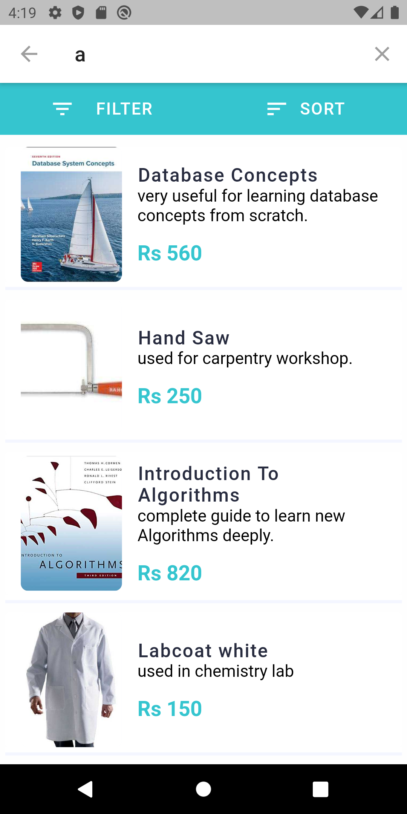
  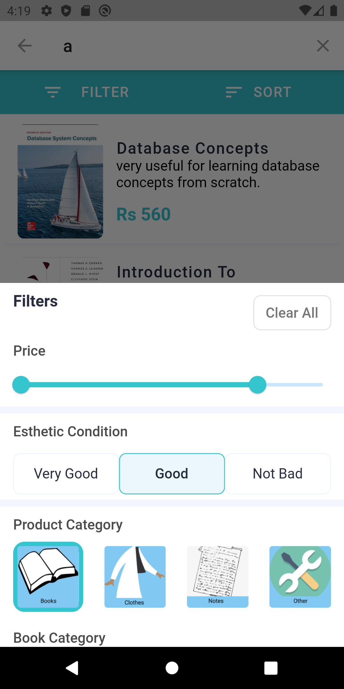
  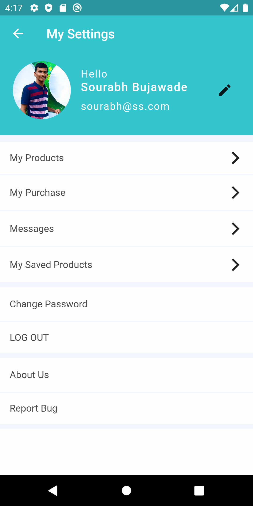
  
  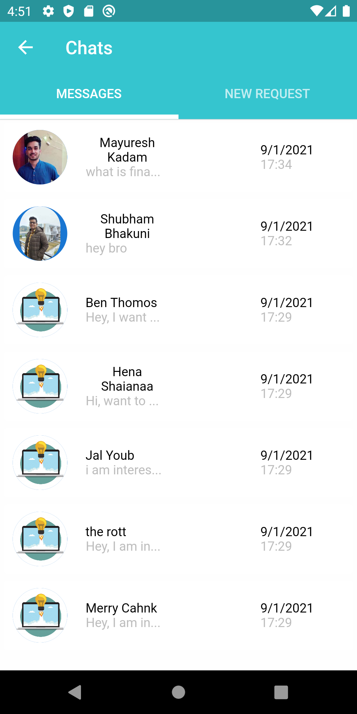
  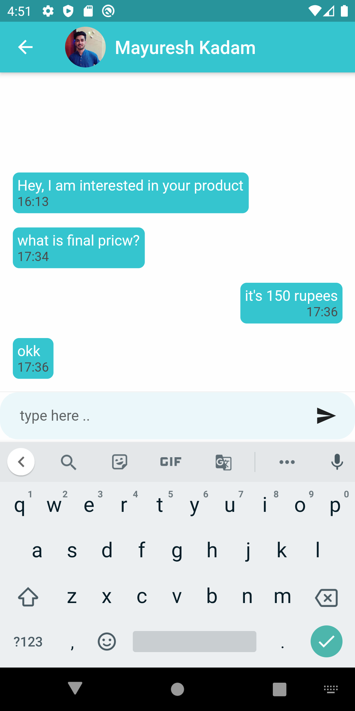
  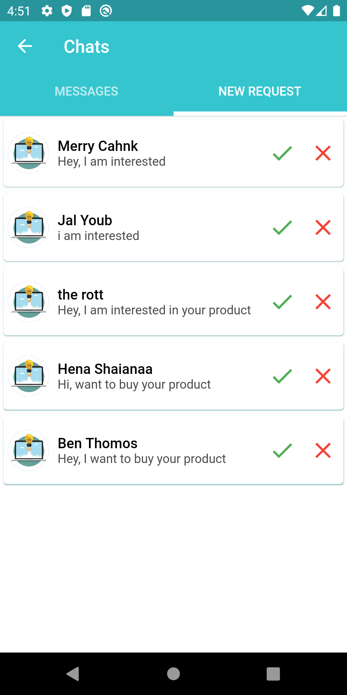
  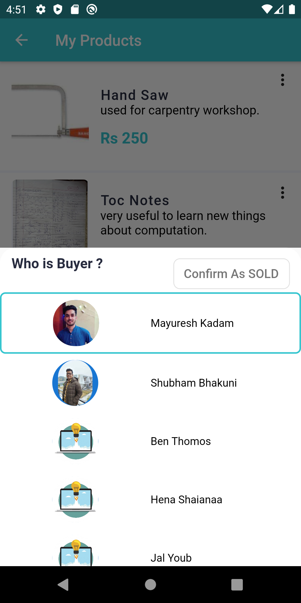
  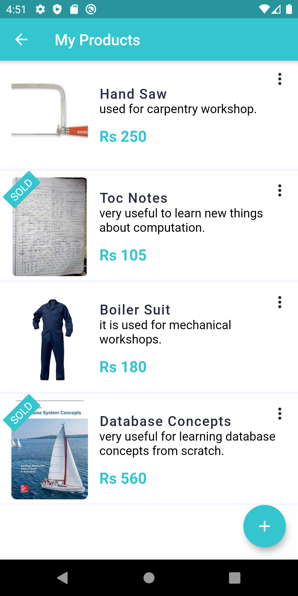
</p>

### Show some :heart: and star the repo to support the project

### Technology Stack

- Flutter
- Flutter Providers
- Firebase


### Installation

```sh
$ cd ShopConn-Flutter-App
$ flutter run
```

### License

Project is published under the [MIT license](/LICENSE.md).
Feel free to clone and modify repo as you want, but don't forget to add reference to authors :)
